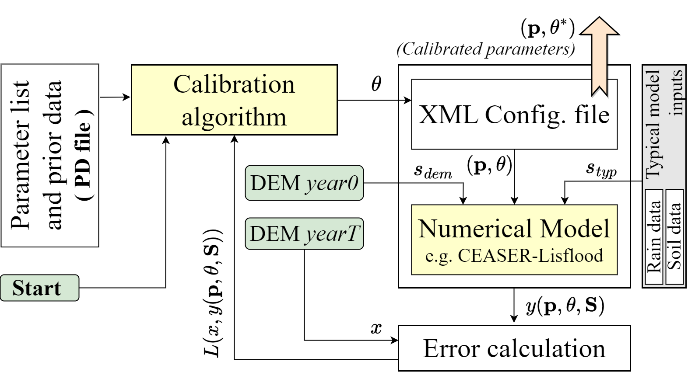

# IMC
**Iterative Model Calibration (IMC) v1.0:** IMC is a generalizable framework for calibrating numerical models in geosciences, particularly geomorphology. It utilizes a Gaussian neighborhood algorithm to efficiently identify optimal parameters, enhancing model precision.  
See paper [here](https://egusphere.copernicus.org/preprints/2024/egusphere-2024-1191/)

To run the IMC algorithm:
1) In a virtual environment install the dependencies (requirements.txt file).
2) Activate the environment
3) IMC_run.py is located at this **PATH** "CL1.9j_new\bin\Debug\IMC_run.py"  
   Go to the location and execute the file.  
   It supports command line argument.

CAESAR-lisflood 1.9j is used to test the IMC and forms the part of the code pacakge. The source code and has been accessed from [here](https://sourceforge.net/projects/caesar-lisflood/files/CAESAR-lisflood%201.9j%20SOURCE.zip/download)  
The CAESAR-lisflood 1.9j source code has been slightly modified to enable interaction with IMC.

  

### Glossary of the codes and relevant files (available at the above PATH location)  
#### (Refer above image)    
<ins>In code name</ins> -----------<ins>Name used in paper</ins>  

IMC_run.py -------------- Calibration algorithm  
our_site.xml -------------- XML config. file  
CL_param_csv_short.csv --PD file  
g2_2019_fildem.txt ------ DEM year 0  
dod_19_21_orig.txt ------ DOD_Target  
